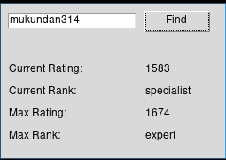

# Codeforces Scraper

Fetches information about a user on codeforces given their handle

## Installation

For rpm based distros you can use the package in the release page for other distros currently you will have to install from source

#### From Source:

```
pip install .
```

## Usage

```
$ codeforces-scraper
```


